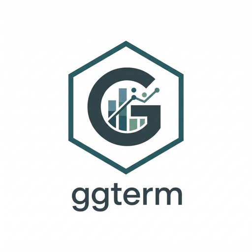

<p align="center">
  
</p>

# ggterm

[](https://www.npmjs.com/package/@ggterm/core)
[](https://opensource.org/licenses/MIT)

**Create data visualizations by describing what you want. No syntax to memorize.**

ggterm is a Grammar of Graphics toolkit for [Claude Code](https://docs.anthropic.com/en/docs/claude-code). Describe your data and what you want to see in natural language — ggterm handles scales, legends, colors, and layout automatically. Plots appear instantly in a live browser panel alongside your terminal.


## Quick Start

```bash
mkdir my-analysis && cd my-analysis
npx ggterm-plot setup
```

That's it. This installs everything, generates a welcome plot, opens the live viewer in your browser, and starts the server. Now talk to Claude:

```
You: Load the iris dataset and show me sepal length vs petal length, colored by species

Claude: [Creates scatter plot — appears instantly in the live viewer]

You: Add a trend line and style it like Nature journal

Claude: [Updates the plot in place with regression line and Nature styling]

You: Export as PNG for my paper

Claude: [Generates publication-ready output]
```

## What You Can Do

| You say... | What happens |
|------------|-------------|
| "Load my data and show me X vs Y" | Scatter plot with automatic scales and labels |
| "Color by group" | Color encoding with legend |
| "Show the distribution of X" | Histogram or density plot |
| "Compare groups with box plots" | Grouped boxplots with stats |
| "Add a trend line" | Linear or loess regression overlay |
| "Style like Tufte / Economist / Nature" | Publication style presets |
| "Export as PNG" | Publication-ready output |
| "Show me my previous plots" | Browse plot history |

## 66 Plot Types

ggterm includes specialized visualizations across domains:

| Category | Types |
|----------|-------|
| **Essentials** | scatter, line, bar, area, histogram, density, boxplot, violin |
| **Advanced** | ridgeline, beeswarm, heatmap, treemap, sankey, calendar heatmap, lollipop, waffle |
| **Scientific** | volcano plot, Manhattan plot, Kaplan-Meier curves, forest plot, ROC curve, Q-Q plot, Bland-Altman, PCA biplot |
| **Diagnostics** | ECDF, funnel plot, control chart, scree plot, correlation matrix, UpSet plot, dendrogram |

See the full [Geometry Reference](./docs/GEOM-REFERENCE.md).

## Built-in Datasets

Start exploring immediately with bundled datasets — no files needed:

```
You: Plot the iris dataset, sepal length vs petal length, colored by species

You: Show me the mtcars data — MPG vs horsepower, colored by cylinders
```

| Dataset | Rows | Columns |
|---------|------|---------|
| **iris** | 150 | sepal_length, sepal_width, petal_length, petal_width, species |
| **mtcars** | 16 | mpg, cyl, hp, wt, name |

Or bring your own CSV, JSON, or JSONL files.

## How It Works

ggterm runs as a companion to Claude Code. The live viewer sits in a browser panel (or [Wave terminal](https://www.waveterm.dev/) side panel) and automatically displays every plot you create:

- **Instant display** — plots appear as interactive Vega-Lite visualizations (tooltips, zoom, pan)
- **Command palette** — press `Cmd+K` to fuzzy-search 80+ commands, all 66 geom types, style presets, and export actions
- **Plot history** — every plot saved automatically; press `h` for the history sidebar, arrow keys to browse, `Home`/`End` to jump
- **Help panel** — press `?` for a 5-tab reference (Getting Started, Plot Types, Shortcuts, Styles, Export)
- **Style in place** — apply publication presets (Wilke, Tufte, Nature, Economist, APA) without re-running; viewer updates live
- **Export** — press `s`/`p` for SVG/PNG directly from the viewer, or generate standalone HTML

Under the hood, ggterm is a comprehensive [Grammar of Graphics](https://www.amazon.com/Grammar-Graphics-Statistics-Computing/dp/0387245448) implementation — the same foundation as R's ggplot2. Every plot is represented as a declarative `PlotSpec` that can be rendered to terminal ASCII art or converted to Vega-Lite for the browser. 66 geometry types, 75 scales, statistical transforms, faceting, and themes — all composable through the grammar.

## Examples

See complete AI-driven workflows with real data:

| Example | What you'll learn |
|---------|-------------------|
| [Exploratory Analysis](./examples/01-exploratory-analysis.md) | Discover patterns in the mtcars dataset through conversation |
| [Publication Figures](./examples/02-publication-figures.md) | Iteratively refine iris plots to publication quality |
| [Streaming Dashboard](./examples/03-streaming-dashboard.md) | Build a real-time monitoring display |
| [Comparative Analysis](./examples/04-comparative-analysis.md) | Compare distributions with statistical annotations |

## Installation Options

### One Command (Recommended)

```bash
mkdir my-analysis && cd my-analysis
npx ggterm-plot setup    # Init + welcome plot + open browser + start server
```

### Add to Existing Project

```bash
npm install @ggterm/core
npx ggterm-plot init     # Install Claude Code skills
npx ggterm-plot serve    # Start live viewer
```

### Interactive REPL (No AI)

```bash
npx ggterm
```

```
ggterm> .data iris
Loaded Iris dataset: 150 rows, 5 columns

ggterm> gg(data).aes({x: "sepal_length", y: "petal_length", color: "species"}).geom(geom_point())

              Sepal vs Petal Length
  7.0 ┤                         ■■■■
      │                      ■■■■■■■■
  6.0 ┤                   ■■■■■■■■
      │               ●●●●●■■■■■
  5.0 ┤            ●●●●●●●●●
      │         ●●●●●●●●
  4.0 ┤       ●●●●●●
      │     ●●●●
  3.0 ┤   ●●●
      │
  2.0 ┤▲▲▲▲▲▲
      │▲▲▲▲▲▲▲
  1.0 ┤▲▲▲▲
      └──────────────────────────────────
       4.5   5.0   5.5   6.0   6.5   7.0

      ▲ setosa  ● versicolor  ■ virginica
```

## For Developers

Use the programmatic API directly:

```typescript
import { gg, geom_point, scale_color_viridis } from '@ggterm/core'

const plot = gg(data)
  .aes({ x: 'sepal_length', y: 'petal_length', color: 'species' })
  .geom(geom_point())
  .scale(scale_color_viridis())
  .labs({ title: 'Iris Dataset' })

console.log(plot.render({ width: 80, height: 24 }))
```

Every plot is a backend-agnostic `PlotSpec` — a JSON-serializable specification consumed by the terminal renderer or Vega-Lite exporter. New backends can be added without modifying the grammar layer. See the [Architecture](./docs/ARCHITECTURE.md) for details.

## Resources

- [Quick Start Guide](./docs/QUICKSTART.md)
- [Geometry Reference](./docs/GEOM-REFERENCE.md) — all 66 plot types
- [Live Viewer Guide](./docs/VIEWER.md) — command palette, history, keyboard shortcuts
- [Architecture](./docs/ARCHITECTURE.md) — PlotSpec, backends, layer model
- [API Reference](./docs/API.md)
- [Migration from ggplot2](./docs/MIGRATION-GGPLOT2.md)
- [Contributing](./CONTRIBUTING.md)

## License

MIT
