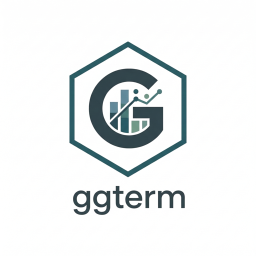
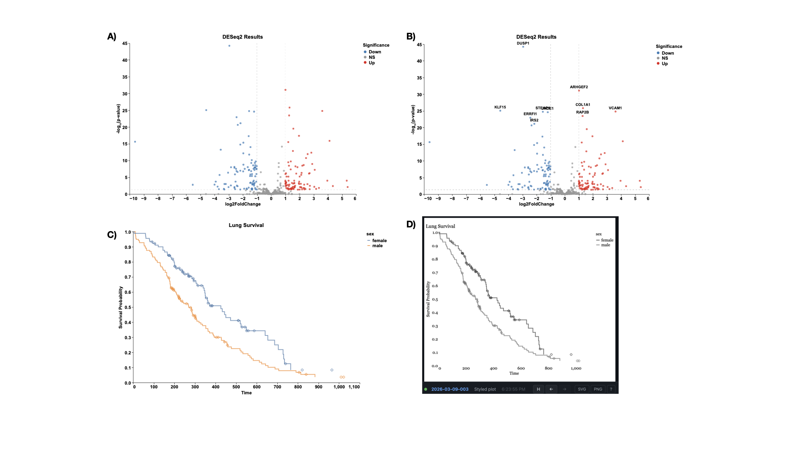

<p align="center">
  
</p>

# ggterm

[](https://www.npmjs.com/package/@ggterm/core)
[](https://opensource.org/licenses/MIT)
[](https://doi.org/10.5281/zenodo.23045577)

**A Grammar of Graphics engine for the terminal, designed for AI coding assistants.**

ggterm brings compositional data visualization into terminal workflows where AI assistants like [Claude Code](https://docs.anthropic.com/en/docs/claude-code) and [Codex](https://openai.com/codex) operate. Describe what you want to see — ggterm handles scales, legends, colors, and layout. Plots render as terminal ASCII art for instant feedback, and as interactive Vega-Lite in a companion browser viewer for publication-quality output.

> **Project status (September 2026):** stable, not under active development. The npm packages work as documented and the test suite (2,177 tests) passes, but no new features are planned. The reusable declarative core (PlotSpec types, geometry builders, Vega-Lite converter) lives in [`packages/spec`](./packages/spec) as `@ggterm/spec`. Bug reports are welcome; response time will vary.

<p align="center">
  
</p>

<p align="center"><em>Conversational visualization workflow. (A) Volcano plot from DESeq2 results. (B) AI-added gene labels for top significant genes. (C) Kaplan-Meier survival curves styled for publication. (D) Live browser viewer with export controls.</em></p>

## Quick Start

```bash
npx ggterm-plot setup
```

That's it. This installs everything, starts the live viewer, and opens your browser. Now open a second terminal and talk to Claude Code:

```
You: Plot the airway DESeq2 results as a volcano plot
Claude: [Creates volcano plot — appears in the live viewer]

You: Label the top 10 most significant genes
Claude: [Adds gene labels, viewer auto-updates]

You: Style for Nature and export as SVG
Claude: [Applies Nature preset, exports publication figure]
```

Or use the CLI directly — no AI required:

```bash
npx ggterm-plot airway log2FoldChange padj gene "DESeq2 Results" volcano
npx ggterm-plot lung time status sex "Lung Survival" kaplan_meier
npx ggterm-plot iris sepal_length sepal_width species "Iris" point
```

## 66 Plot Types

| Category | Types |
|----------|-------|
| **Essentials** | scatter, line, bar, area, histogram, density, boxplot, violin |
| **Advanced** | ridgeline, beeswarm, heatmap, treemap, sankey, calendar heatmap, lollipop, dumbbell, waffle |
| **Scientific** | volcano, MA plot, Manhattan plot, Kaplan-Meier, forest plot, ROC curve, Q-Q plot, Bland-Altman, PCA biplot |
| **Diagnostics** | ECDF, funnel plot, control chart, scree plot, correlation matrix, UpSet plot, dendrogram |
| **Terminal-Native** | sparkline, braille (8x resolution), bullet chart |

See the full [Geometry Reference](./docs/GEOM-REFERENCE.md).

## Built-in Datasets

Start exploring immediately — no files needed:

| Dataset | Rows | Description |
|---------|------|-------------|
| **iris** | 150 | Fisher's classic: sepal/petal measurements across 3 species |
| **mtcars** | 16 | Motor Trend car data: mpg, hp, weight, cylinders |
| **airway** | 500 | DESeq2 differential expression (Himes et al. 2014): log2FC, p-values, gene symbols |
| **lung** | 227 | NCCTG lung cancer survival (Loprinzi et al. 1994): time, status, sex, ECOG score |

Or bring your own CSV, JSON, or JSONL files. On setup, ggterm scans your directory, infers column types and value ranges, and writes a data catalog so your AI assistant already knows your data.

## Live Viewer

A companion browser panel connects to ggterm via Server-Sent Events and displays every plot as an interactive Vega-Lite visualization:

- **Live updates** — plots and style changes appear instantly (tooltips, zoom, pan)
- **Command palette** — `Cmd+K` to fuzzy-search all 66 geom types, export actions, and style presets
- **Plot history** — every plot saved automatically; `h` for history sidebar, arrow keys to browse
- **Publication styles** — Wilke, Tufte, Nature, Economist, APA presets; apply without re-rendering
- **Export** — `s` for SVG, `p` for PNG directly from the viewer
- **HPC support** — auto-detects SLURM/PBS/LSF/SGE compute nodes and prints SSH tunnel commands

## How It Works

ggterm is a [Grammar of Graphics](https://link.springer.com/book/10.1007/0-387-28695-0) implementation — the same foundation as R's ggplot2. Every plot is a declarative `PlotSpec` (JSON-serializable) consumed by two backends:

1. **Terminal** — Unicode block characters, Braille symbols (8x resolution), ANSI 24-bit color
2. **Vega-Lite** — interactive browser visualizations, PNG/SVG/PDF export

Eight integration skills for Claude Code connect natural language to deterministic CLI operations. The AI doesn't generate arbitrary code — it invokes specific commands with structured arguments.

## What You Can Say

| You say... | What happens |
|------------|-------------|
| "Load my data and show me X vs Y" | Scatter plot with automatic scales and labels |
| "Color by group" | Color encoding with legend |
| "Show the distribution of X" | Histogram or density plot |
| "Create a volcano plot of the DESeq2 results" | Domain-specific visualization |
| "Label the top 10 significant genes" | AI customization of the current plot |
| "Style like Nature" | Publication style preset |
| "Export as SVG" | Publication-ready vector output |
| "Show me my previous plots" | Browse plot history |

## Installation

### One Command (Recommended)

```bash
npx ggterm-plot setup
```

### Add to Existing Project

```bash
npx ggterm-plot init     # Install Claude Code skills
npx ggterm-plot serve    # Start live viewer
```

### CLI Only (No AI)

```bash
npx ggterm-plot iris sepal_length sepal_width species "Iris" point
npx ggterm-plot mydata.csv x_col y_col group_col "Title" histogram
```

### Programmatic API

```typescript
import { gg, geom_point, scale_color_viridis } from '@ggterm/core'

const plot = gg(data)
  .aes({ x: 'sepal_length', y: 'petal_length', color: 'species' })
  .geom(geom_point())
  .scale(scale_color_viridis())
  .labs({ title: 'Iris Dataset' })

console.log(plot.render({ width: 80, height: 24 }))
```

## Resources

- [Quick Start Guide](./docs/QUICKSTART.md)
- [Geometry Reference](./docs/GEOM-REFERENCE.md) — all 66 plot types
- [Live Viewer Guide](./docs/VIEWER.md) — command palette, history, keyboard shortcuts
- [Architecture](./docs/ARCHITECTURE.md) — PlotSpec, backends, layer model
- [API Reference](./docs/API.md)
- [Contributing](./CONTRIBUTING.md)

## Citation

If you use ggterm in published research, please cite this repository:

> Handley SA, Droit LN, Johnson MR, Wang L. ggterm: Grammar of Graphics for Terminal-Based Data Visualization. Zenodo (2026). https://doi.org/10.5281/zenodo.23045577

The DOI above covers all versions and resolves to the latest release; the v0.3.15 release specifically is [10.5281/zenodo.23045578](https://doi.org/10.5281/zenodo.23045578). Citation metadata is in [`CITATION.cff`](./CITATION.cff) (used by GitHub's "Cite this repository" button and by Zenodo). A manuscript draft is available in [`paper/`](./paper/).

## License

MIT
